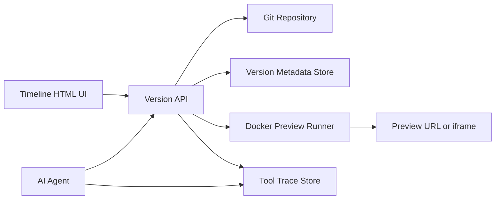

# Versioned UI Preview Architecture

## Purpose

Add a GitHub-like visual history for generated applications.

The user should be able to:

- See every meaningful project version on a visual timeline.
- Preview an older version of the application.
- Select an older version and continue editing from it.
- Automatically create a new branch when continuing from an older version.
- Run the selected project snapshot inside an isolated Docker container.
- See the live application or screenshot directly from the timeline.

## Core idea

Every accepted edit becomes a Git checkpoint:

```text
Initial Todo App
      │
      ├── UI edit 1
      │       │
      │       ├── UI edit 2
      │       │       │
      │       │       └── UI edit 3
      │       │
      │       └── New branch from UI edit 1
      │               │
      │               └── New design direction
```

Git stores the exact files. Docker renders a selected Git snapshot. MongoDB stores version metadata, preview state, screenshots, and trace references.

## High-level architecture



### Components

#### Timeline UI

A static HTML and JavaScript interface that displays:

- Version nodes.
- Commit messages.
- User prompts.
- Timestamps.
- Branch names.
- Screenshots or preview thumbnails.
- Current active branch.
- Preview and branch actions.

The UI should not execute Git or Docker commands directly. It should call the Version API.

#### Version API

A small backend service, such as FastAPI, that owns Git, Docker, and metadata operations.

Possible endpoints:

```text
GET  /projects/{project_id}/versions
GET  /projects/{project_id}/versions/{commit_sha}
POST /projects/{project_id}/versions/{commit_sha}/preview
POST /projects/{project_id}/versions/{commit_sha}/branch
GET  /projects/{project_id}/previews/{preview_id}
GET  /projects/{project_id}/traces
```

#### Git repository

Git is the source of truth for project files and version history.

The system should create checkpoints only after meaningful events:

- The user accepts an edit.
- The agent completes a meaningful UI change.
- The user explicitly asks to save a version.
- A preview passes its health check.

Do not create a commit for every individual model operation; that would make the timeline noisy.

#### Version metadata store

MongoDB can store metadata that does not belong directly in Git:

```json
{
  "project_id": "todo-app",
  "commit_sha": "abc123",
  "parent_sha": "def456",
  "branch": "design/todo-v2",
  "prompt": "Make the todo cards more modern",
  "created_at": "2026-08-16T12:00:00Z",
  "preview_id": "preview_123",
  "preview_status": "ready",
  "preview_url": "http://localhost:8123",
  "screenshot_path": "/previews/preview_123.png"
}
```

#### Docker Preview Runner

The Preview Runner creates an isolated application preview from a specific commit.

```text
commit SHA
   ↓
git worktree or git archive
   ↓
Docker build
   ↓
Docker run
   ↓
health check
   ↓
preview URL and optional screenshot
```

Example flow:

```bash
git worktree add /tmp/todo-preview-abc123 abc123
docker build -t todo-preview-abc123 /tmp/todo-preview-abc123
docker run --rm -p 8123:3000 todo-preview-abc123
```

For a plain HTML project, the container can serve files with Nginx. For React or another framework, the container should install dependencies, build the project, and start the application server.

The timeline page can embed the running application:

```html
<iframe src="http://localhost:8123"></iframe>
```

The browser should not load all source files directly. The backend should materialize the selected snapshot, and Docker should serve the application from that snapshot.

## Branching workflow

Suppose the user has made three UI edits:

```text
main
 └── edit-1
      └── edit-2
           └── edit-3
```

The user selects `edit-1` and chooses **Continue from here**.

The backend creates a new branch from that commit:

```bash
git switch -c design/from-edit-1 edit-1
```

The new work then becomes:

```text
design/from-edit-1
 ├── new edit A
 └── new edit B
```

The original `edit-2` and `edit-3` remain available and unchanged.

Recommended branch names:

```text
design/{project}-{short_commit_sha}-{timestamp}
experiment/{project}-{short_commit_sha}
agent/{project}-{session_id}
```

## Agent tools

The current tool system can be extended with specialized tools:

```text
create_checkpoint
list_versions
preview_version
branch_from_version
switch_active_version
get_preview_logs
stop_preview
```

Example tool contracts:

```python
create_checkpoint(
    project_id: str,
    message: str,
    prompt: str,
) -> Version
```

```python
branch_from_version(
    project_id: str,
    commit_sha: str,
    branch_name: str | None = None,
) -> Branch
```

```python
preview_version(
    project_id: str,
    commit_sha: str,
) -> Preview
```

The agent should work only inside the active branch/worktree. Selecting an older version should change the active worktree rather than modify the old commit.

## Trace integration

Every Git, Docker, build, and test operation should be connected to the version that caused it.

```json
{
  "trace_id": "trace_789",
  "project_id": "todo-app",
  "tool": "preview_version",
  "commit_sha": "abc123",
  "branch": "design/from-edit-1",
  "preview_id": "preview_456",
  "container_id": "container_789",
  "status": "success",
  "duration_ms": 3200
}
```

This allows the timeline to answer questions such as:

- Which agent action created this version?
- Which Docker build failed?
- Which command produced this screenshot?
- Which files changed between two versions?

The existing tracing implementation in `voice_coding_agent/tools/tool_trace.py` can be extended with `project_id`, `commit_sha`, `branch`, and `preview_id` fields.

## Preview lifecycle

```text
1. User selects a version.
2. Version API validates the commit.
3. Backend creates an isolated worktree.
4. Docker image is built for that worktree.
5. Container starts with resource limits.
6. Health endpoint is checked.
7. Preview URL is returned.
8. Timeline displays the live application.
9. Container is stopped when the preview expires.
```

For speed, previews can be cached by commit SHA. If the same commit is requested again, the existing preview can be reused when it is still healthy.

## Security requirements

Generated code must be treated as untrusted code.

Docker previews should use:

- Non-root containers.
- CPU and memory limits.
- Execution timeouts.
- Ephemeral containers and volumes.
- No Docker socket mounted inside the preview container.
- Restricted or disabled network access by default.
- An allowlist for package installation and external services.
- Separate preview containers for separate projects or branches.

Git and Docker operations should remain backend operations. The HTML UI should not receive direct access to the host terminal.

## Implementation phases

### Phase 1: Git timeline

- Create checkpoints.
- List commits and branches.
- Display a visual timeline.
- Select a commit.
- Create a new branch from the selected commit.

### Phase 2: Docker previews

- Build a selected commit.
- Start the project in Docker.
- Return a preview URL.
- Display the preview in an iframe.
- Add container logs and health status.

### Phase 3: Agent integration

- Make the agent aware of the active branch and commit.
- Apply edits only to the active worktree.
- Create checkpoints after accepted edits.
- Attach tool traces to versions.

### Phase 4: Visual comparison

- Capture screenshots for each checkpoint.
- Add side-by-side comparison.
- Show file diffs between versions.
- Add restore, fork, and delete-preview actions.

## Recommended first milestone

Build the smallest useful version first:

1. Create one Git commit after each accepted UI edit.
2. Build an HTML timeline from `git log`.
3. Add a **Branch from here** button.
4. Start a Docker preview for the selected commit.
5. Show the preview in an iframe.

Once that works reliably, add screenshots, MongoDB metadata, trace linking, and richer visual comparisons.
